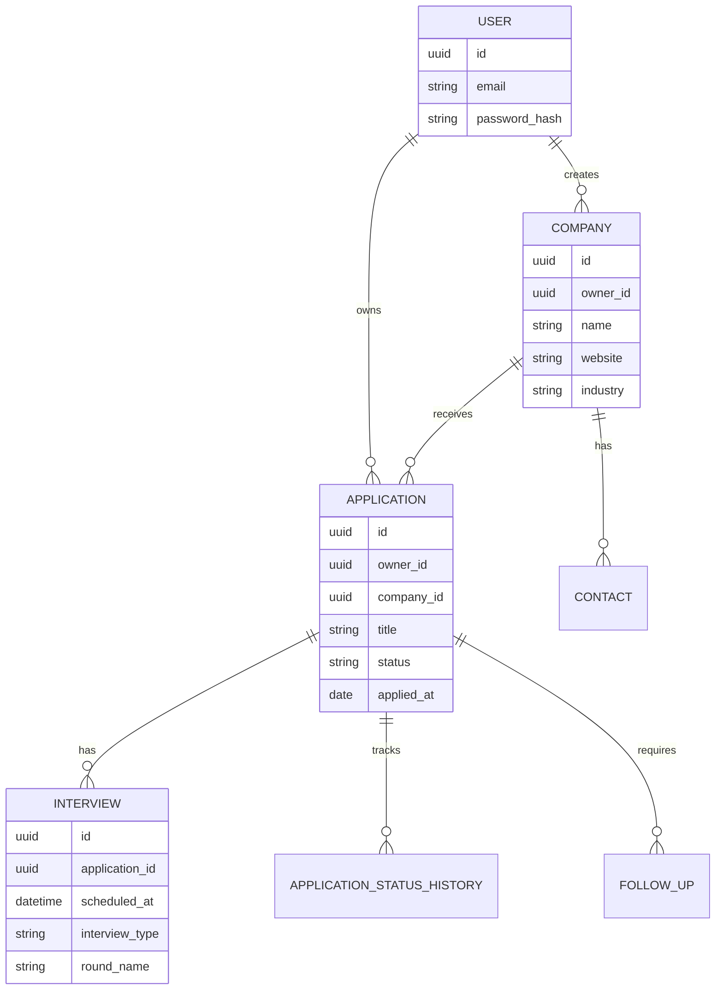

# Entity Relationship Diagram

```mermaid
erDiagram
    USER ||--o{ APPLICATION : owns
    USER ||--o{ COMPANY : creates
    COMPANY ||--o{ APPLICATION : receives
    APPLICATION ||--o{ INTERVIEW : has
    APPLICATION ||--o{ APPLICATION_STATUS_HISTORY : tracks
    COMPANY ||--o{ CONTACT : has
    APPLICATION ||--o{ FOLLOW_UP : requires

    USER {
        uuid id
        string email
        string password_hash
    }
    COMPANY {
        uuid id
        uuid owner_id
        string name
        string website
        string industry
    }
    APPLICATION {
        uuid id
        uuid owner_id
        uuid company_id
        string title
        string status
        date applied_at
    }
    INTERVIEW {
        uuid id
        uuid application_id
        datetime scheduled_at
        string interview_type
        string round_name
    }
```

## Notes

- UUID primary keys are preferred for external-facing resources.
- Status history is modeled separately to preserve auditability.

