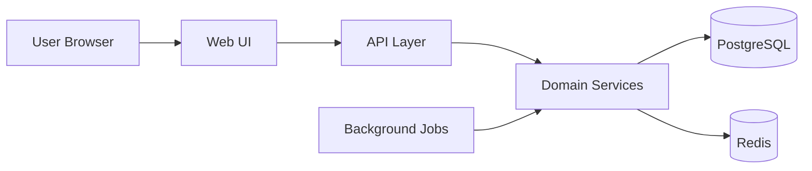

# Architecture Overview

## Context

The platform is designed as a modular web application with a clear separation between domain logic, presentation, and infrastructure concerns.

## Proposed Stack

- Django for core application framework
- Django REST Framework for APIs
- PostgreSQL for persistent relational storage
- Redis for caching and background job coordination
- Celery or Django Q for reminder jobs
- Docker for local and production packaging
- Nginx as reverse proxy in production

## Logical Architecture

## Architectural Goals

- keep business rules close to the domain model
- isolate app boundaries by business capability
- support incremental growth without a rewrite

