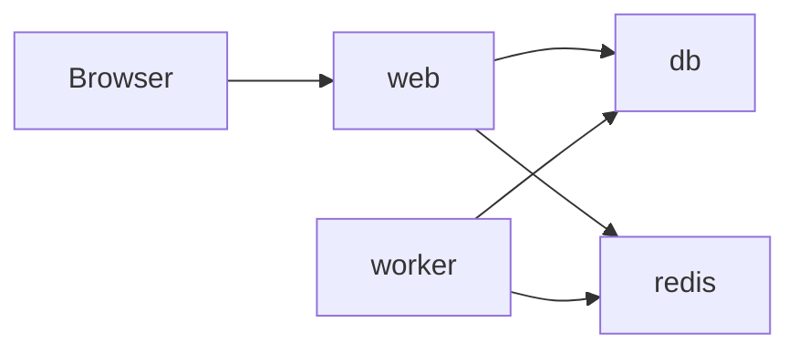

# Docker

## Goals

- reproducible local setup
- consistent deployment packaging
- isolated service dependencies

## Proposed Services

- `web`
- `db`
- `redis`
- `worker`

## Example Compose Topology

